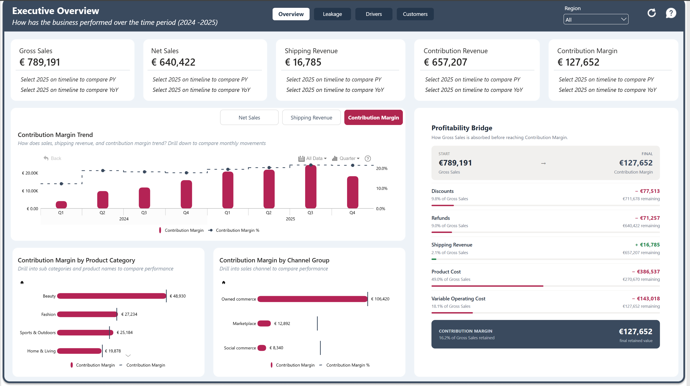
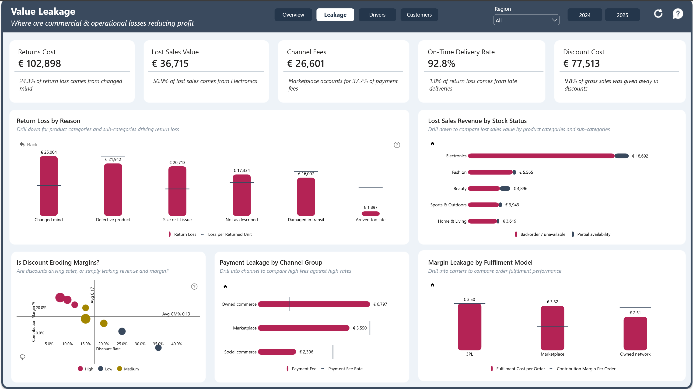
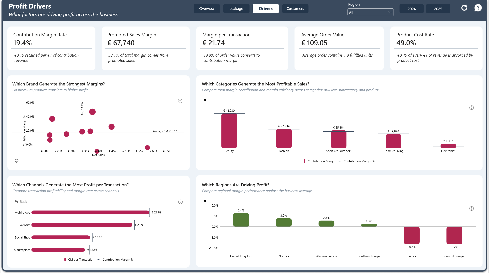
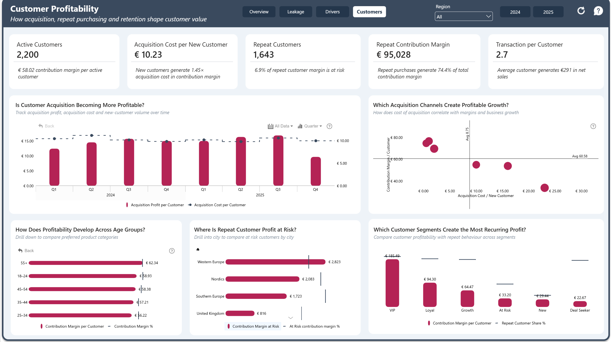

# E-Commerce Profitability Analysis

A Power BI analysis investigating why the business is not converting more of its sales into contribution margin.

The report follows profitability from revenue through value leakage, profit drivers, and customer economics.

## Live Dashboard

[View the Interactive Power BI Report](https://app.powerbi.com/view?r=eyJrIjoiYmVkZmE0ZmEtN2ZjNS00Njc5LWIwY2ItZmQ2YmFhNmFkZTI5IiwidCI6IjQ2NTRiNmYxLTBlNDctNDU3OS1hOGExLTAyZmU5ZDk0M2M3YiIsImMiOjl9)

## Business Question

**Why isn’t the business converting more sales into contribution margin, and where can profitability improve?**

The analysis is structured around four questions:

**How profitable is the business? → Where is value leaking? → What drives profit? → Are customers creating sustainable value?**

## Key Findings

- Gross Sales of **€789.2K** generated **€127.7K Contribution Margin**.
- Product cost absorbs **49.0% of revenue**, making product economics a major constraint on margin.
- **€77.5K** was given away through discounts, while returns generated **€102.9K** in return-related loss.
- Lost sales totalled **€36.7K**, alongside **€26.6K** in channel fees.
- Repeat purchases generated **€95.0K**, representing **74.4% of total Contribution Margin**.

## Dashboard

### 1. Profitability Overview

Shows how Gross Sales convert into Contribution Margin and where value is absorbed across the profitability bridge.

### 2. Value Leakage

Examines returns, discounting, lost sales, payment fees, and fulfilment performance to identify where value is being eroded.

### 3. Profit Drivers

Explores how product mix, brand positioning, sales channels, and geographic markets contribute to profitability.

### 4. Customer Profitability

Assesses acquisition economics, repeat purchase behavior, customer lifetime value, and contribution margin at risk.

## Dataset

The project uses a synthetic European e-commerce challenge dataset covering transactions across 2024–2025.

The data links orders to products, customers, geographic markets, promotions, sales channels, fulfilment providers, and returns, enabling profitability to be analysed from Gross Sales through to Contribution Margin.

## Tools & Skills

**Power BI · DAX · Power Query · Star Schema Modelling · Data Modelling · ZoomCharts · Business Analysis · Data Visualisation**

## Full Case Study

[Read the full portfolio case study](documentations/Case-Study.docx)
